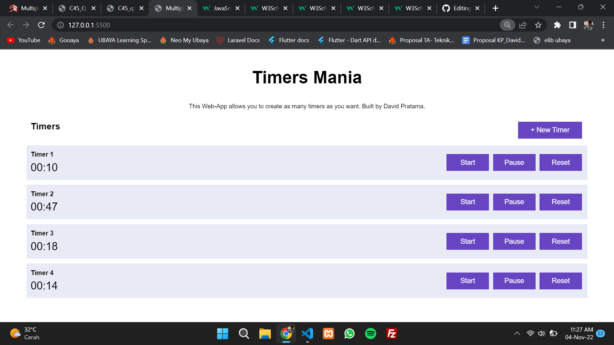

# Multiple-Timer

This is about how to make a timer easily using html,css and js. And if you click on new timer, it'll become multiple timer. So is it easy right to do that?? :D 
Do you want to collaboration with me? Feel free to contact me via DM on instagram @daviddprtma and we can collab together to build the awesome app 

##Result App
</img>
